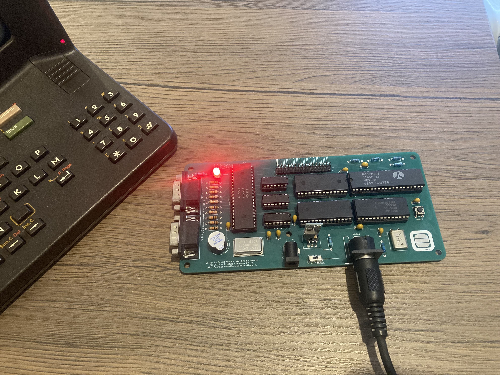
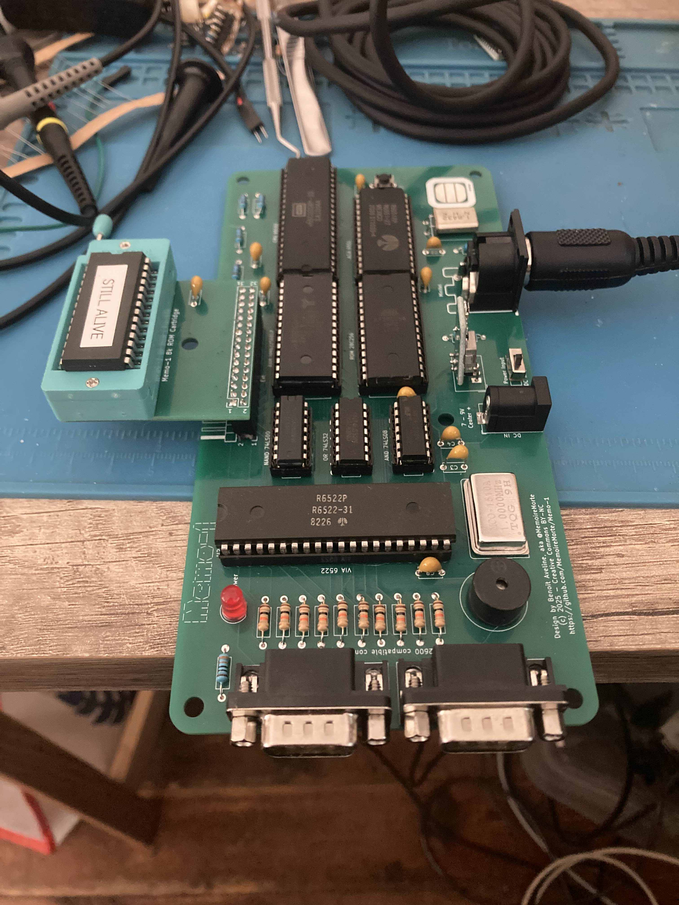
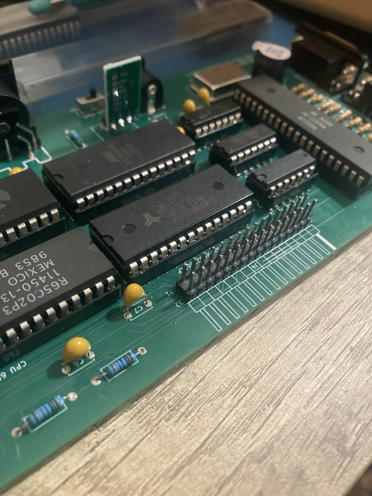

# How to Build Your Memo-1

## Board Versions

**Important:** There are currently 2 versions of the board:
- **Green board** - The "prototype" version
- **White board** - Labelled "Rev-1"

Depending on the version you have, refer to the appropriate bill of materials. The differences are minimal.

## Before You Start

### Bill of Materials
In each file I provided a link for every component. I didn't look for cheap or quality. The goal was just to find an example.
Refer to the BOM specific to your board version:
- **Prototype (Green board)**: [BOM_Prototype.csv](BOM_Prototype.csv)
- **Rev-1 (White board)**: [BOM_Rev1.csv](BOM_Rev1.csv)

### ROM Chip Options
The ROM chip 28C256 can be replaced with a 27128, but **with a 27128 pin 1 must be unconnected** (just lift it from the socket).
- **27128**: Use the 16k binary
- **28C256**: Use the 32k binary (same 16k binary with a 16k offset)

The 28C256 is larger than needed but easier to find and program.

### DC-DC Converter Setup
Before soldering, configure your DC-DC converter to output 5V using one of these methods:
1. **Adjustment method**: Power the converter externally and turn the small screw while measuring with a multimeter (do NOT do this in-circuit with other components soldered)
2. **Jumper method**: Cut the ADJ jumper on the back and make a small solder bridge on the 5V setting (verify twice you have no continuity on the ADJ pads)

## Assembly Instructions

### Step 1: Solder Passive Components
1. **Resistors** - Start with these first
2. **IC sockets** - Double check the socket direction using the silkscreen for notch orientation
   - **⚠️ DO NOT insert ICs yet!**
3. **Capacitors**

### Step 2: Solder Power Components
1. **DIN-5 connector** in J3
2. **Barrel jack** in J5
3. **Power switch** in SW2
4. **DC-DC converter** in U9
   - When viewing the Memo-1 in reading orientation:
     - First pin on the left (EN): **leave unsoldered**
     - Second pin (IN+): solder to leftmost pad
     - Third pin (GND): solder to center pad
     - Fourth pin (VO+): solder to right pad
5. **LED** in D1

### Step 3: Power Testing
Feed power through either the barrel jack or the DIN-5 (with a Minitel). The LED should turn on.

#### Troubleshooting Power Issues
If the LED doesn't light up:
- Verify the power switch is positioned toward the power source
- Check U9 is soldered properly (see pinout above)
- Measure input voltage between IN+ of the DC-DC converter and GND
- Measure output voltage between GND and VO+ - should be **5V**
- Check LED polarity

### Step 4: Final Assembly
Once 5V is confirmed:
1. Solder all remaining components
2. **Before inserting ICs**: 
   - Verify power is still correct
   - Double-check all pins are properly soldered
3. Insert ICs into sockets
   - Verify correct orientation: **the CPU is backwards compared to other ICs**
   - Ensure all pins are properly seated

## Testing Your Memo-1

1. Connect a MIDI cable from the back of a Minitel 1B to the Memo-1
2. Switch the Minitel ON
3. Press RESET on the Memo-1

## Testing the Extension Card

To verify the extension card is working properly, you can program it with the provided [stillAlive.bin](stillAlive.bin) demo binary.

## Known Issues

### Prototype (Green) Board
A bodge wire must be installed between:
- RAM chip pin 22
- Extension connector J4 pin 31

### The prototype rom extension
**Critical:** This board has an error, as the 2 row of pins are inverted. Solder the female pin sockets under the board.
On the Rev-1 (black rom extension pcb) it is fixed and the female socket headers can be soldered on the front side of the pcb, and the motherboard must use 90° angled male pin headers.

